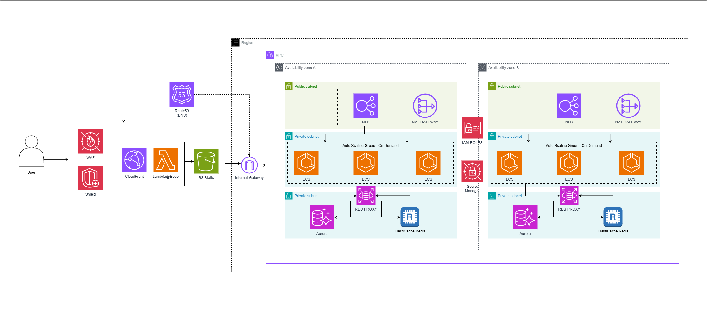

# Banking System - Itaú Engineering Case


## 📖 Sobre o Projeto

Este projeto consiste na refatoração completa de uma API bancária legada e no desenvolvimento de um frontend moderno para consumo dos serviços. 

O objetivo principal foi transformar uma aplicação instável e sem padrões em uma solução **robusta, escalável e segura**. O sistema gerencia clientes, transações financeiras (depósitos/saques) e extratos, resolvendo problemas críticos de concorrência financeira e aplicando boas práticas de engenharia de software.

### 🚀 Principais Entregas
- **Refatoração do Backend:** Migração para **NestJS** com **Arquitetura Hexagonal**.
- **Correção de Concorrência:** Implementação de **Pessimistic Locking** para garantir integridade de saldo.
- **Frontend SPA:** Aplicação **Angular 17** com design responsivo via Bootstrap.
- **Ambiente Cloud-Native Local:** **PostgreSQL** containerizado (simulando RDS).

---

## 🏗️ Decisões Arquiteturais

A arquitetura foi desenhada visando **desacoplamento** e **testabilidade**. Adotou-se a **Arquitetura Hexagonal (Ports and Adapters)** para isolar o domínio da aplicação de detalhes de infraestrutura.

### Por que Hexagonal?
- **Isolamento do Domínio:** As regras de negócio (como validação de saldo) não dependem do framework web ou do banco de dados.
- **Facilidade de Testes:** Permite testar a camada de aplicação (`Service`) mockando facilmente os repositórios.
- **Flexibilidade:** Trocar o banco de dados (ex: SQLite para Postgres) impacta apenas a camada de adaptadores, sem tocar nas regras de negócio.

### Diagrama de Infraestrutura (Cloud - AWS)
Abaixo, a representação fiel da arquitetura de infraestrutura proposta, incluindo camadas de Edge, Segurança e Dados, conforme desenhado no projeto:



---

## 🛠️ Tech Stack & Justificativas

### Backend
- **NestJS:** Escolhido pela sua estrutura modular e injeção de dependência nativa, que facilita a aplicação de padrões SOLID e Clean Architecture.
- **TypeORM:** ORM robusto que agiliza o desenvolvimento, mas utilizado atrás de interfaces de repositório para não acoplar o domínio.
- **Winston:** Implementado para **Logging Estruturado**, essencial para observabilidade em produção.
- **Swagger:** Documentação viva da API para facilitar a integração com o Frontend.

### Frontend
- **Angular 17:** Framework enterprise-grade que oferece tipagem forte, injeção de dependência e excelente performance para SPAs complexas.
- **Bootstrap 5:** Para agilidade na construção de interfaces responsivas e acessíveis.

### Infraestrutura
- **Docker & Docker Compose:** Garante que a aplicação rode exatamente igual em qualquer máquina ("It works on my machine" never again).

---

## 💎 Destaques Técnicos

### 1. Solução para Concorrência
O problema original de inconsistência de saldo foi resolvido utilizando **Transações de Banco de Dados** com **Pessimistic Write Lock** (`FOR UPDATE`).
Isso garante que, se duas requisições tentarem alterar o saldo do mesmo cliente simultaneamente, o banco de dados bloqueará a segunda até que a primeira termine, garantindo consistência ACID.

*Local: `backend/src/clients/application/service/transactions.service.ts`*

### 2. Qualidade de Código
- **ESLint & Prettier:** Configurados para garantir estilo de código consistente.
- **Testes Automatizados:** Cobertura de testes unitários e de integração para garantir que refatorações futuras não quebrem funcionalidades críticas.

---

## 🚀 Como Rodar

O projeto suporta execução híbrida (Infraestrutura em Docker + Frontend Local) para facilitar o desenvolvimento.

### Pré-requisitos
- Docker e Docker Compose instalados.
- Node.js (v18+) e NPM instalados.

### Passo a Passo

1. **Clone o repositório:**
   ```bash
   git clone https://github.com/seu-usuario/case-itau-nodejs.git
   cd case_itau_nodejs
   ```

2. **Suba a Infraestrutura e Backend (Docker):**
   Isso iniciará o Banco de Dados (Postgres) e a API Backend.
   ```bash
   docker-compose -f infra/docker-compose.yml up -d --build
   ```
   *Aguarde alguns instantes para que o Backend conecte ao Banco de Dados.*

3. **Inicie o Frontend (Localmente):**
   Em um novo terminal:
   ```bash
   cd frontend
   npm install
   npm start
   ```

4. **Acesse as aplicações:**
   - **Frontend:** [http://localhost:4200](http://localhost:4200)
   - **API Swagger:** [http://localhost:3000/api](http://localhost:3000/api)

---

## 🧪 Testes

A estratégia de testes segue a pirâmide de testes, focando em testes unitários rápidos e testes de integração para fluxos críticos.

### Rodando os Testes (Backend)

```bash
# Entrar no container ou pasta do backend
cd backend

# Testes Unitários (Regras de Negócio)
npm run test

# Testes de Integração (API + Banco)
npm run test:integration

# Relatório de Cobertura
npm run test:cov
```

## 📂 Estrutura de Pastas

```
.
├── backend/                # API NestJS
│   ├── src/
│   │   ├── clients/        # Módulo de Clientes (Hexagonal)
│   │   │   ├── adapters/   # Controladores e Repositórios TypeORM
│   │   │   ├── application/# Casos de uso (Services)
│   │   │   └── domain/     # Entidades e Interfaces
│   │   └── common/         # Interceptors, Loggers, etc.
│   └── test/               # Testes Unitários
├── frontend/               # Aplicação Angular
│   └── src/app/            # Componentes e Serviços
└── infra/                  # IaC (Docker Compose, Scripts AWS)
```
